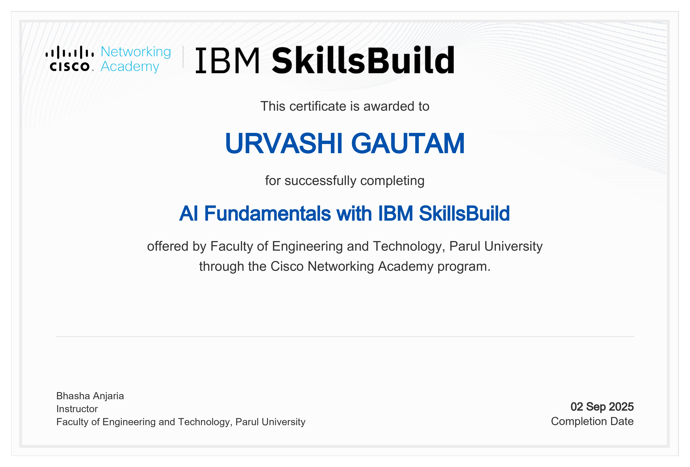
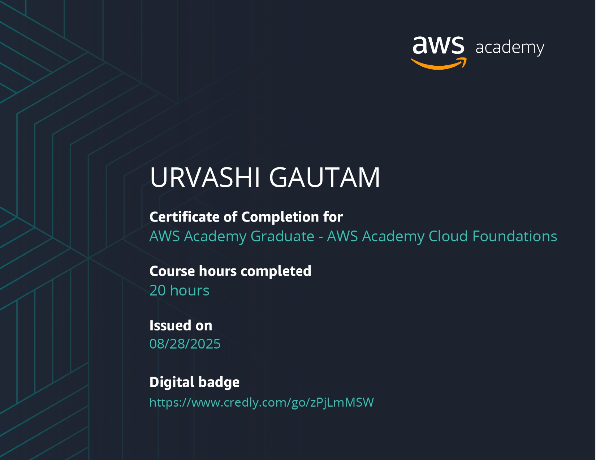

# certificates
My certifications and achievements

# 🏆 Certification Portfolio

### Urvashi Gautam

💻 Software Development • ☁️ Cloud Computing • 🤖 Artificial Intelligence • 🌍 Open Source

*"Learning never exhausts the mind."* — Leonardo da Vinci

---

## 🌟 About This Repository

Welcome to my Certification Portfolio!

This repository showcases my professional certifications, technical training, hackathon participation, and open-source achievements. These credentials reflect my commitment to continuous learning and building expertise in Software Development, Cloud Computing, Artificial Intelligence, and Open Source technologies.

---

# 🚀 Certification Highlights

<table>
<tr>
<td align="center">
 
<b>AWS Cloud Foundations</b>
</td>

<td align="center">
 
<b>AWS Developer Associate</b>
</td>
</tr>

<tr>
<td align="center">
 
<b>IBM AI Fundamentals</b>
</td>

<td align="center">
 
<b>AWS AI Practitioner</b>
</td>
</tr>
</table>

---

# ☁️ Cloud Computing

### AWS Academy Cloud Foundations

---

### AWS Developer Associate

---

### AWS AI Practitioner Training

---

# 🤖 Artificial Intelligence

### IBM SkillsBuild AI Fundamentals

---

# 💡 Professional Development

### Samsung Innovation Campus

---

### Hashgraph Developer Course

---

# 🏅 Hackathons & Open Source

### Cognizant Hackathon Participation

---

### GirlScript Summer of Code (GSSoC)

---

# 📚 Additional Certifications

### Certificate of Participation

---

# 🛠️ Technical Skills Reflected Through These Certifications

| Domain                  | Skills                                    |
| ----------------------- | ----------------------------------------- |
| Programming             | Java, OOP, Problem Solving                |
| Cloud                   | AWS Cloud Foundations, AWS Services       |
| Artificial Intelligence | AI Fundamentals, AI Practitioner Concepts |
| Development             | Software Engineering Practices            |
| Open Source             | Collaboration, Git, GitHub                |
| Hackathons              | Teamwork, Innovation, Rapid Prototyping   |

---

# 📈 Learning Philosophy

I believe that growth comes from consistent learning, practical implementation, and collaboration with the developer community.

Every certification in this repository represents not just course completion, but a step toward becoming a stronger engineer capable of building impactful technology.

---

### ⭐ Thank you for visiting my Certification Portfolio ⭐

If you are a recruiter, developer, or fellow learner, feel free to explore my achievements and connect with me.

### 🌐 Connect With Me

[

[

